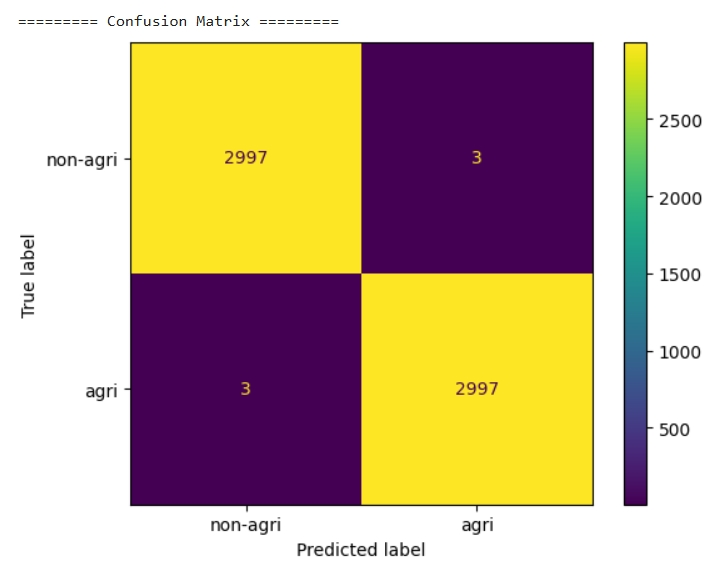

# Land-Classification-project
In this Land Classification project, we implement CNN-Vision Transformer integration framework to evaluate whether the lands are agricultural or not.

## Features in this project

- CNN-ViT hybrid model
- pre-train model leveraging
- Partial customizale neuro network

## Contents of code

Land classification\
├── preparation.py      \
&emsp;&emsp;└── data_download, data_dir   \ 

├── requirements.py      # install necessary packages.\

├── def_frames.py                # multiple class module and helper functions. \
&emsp;&emsp;├── ConvNet     #CNN net \
&emsp;&emsp;&emsp;&emsp;├── __init__\
&emsp;&emsp;&emsp;&emsp;&emsp;&emsp;├── features    # Seq model \
&emsp;&emsp;&emsp;&emsp;&emsp;&emsp;├── pool      	# AdaptiveAvgPool2d		\
&emsp;&emsp;&emsp;&emsp;&emsp;&emsp;└── classifier  # Seq model  \
&emsp;&emsp;&emsp;&emsp;├── forward_features \
&emsp;&emsp;&emsp;&emsp;└── forward.  

&emsp;&emsp;├── ViT\
&emsp;&emsp;&emsp;&emsp;├── __init__\
&emsp;&emsp;&emsp;&emsp;&emsp;&emsp;├── TransformerBlock(Encoder Block)    # include multi-head Self attention \
&emsp;&emsp;&emsp;&emsp;&emsp;&emsp;&emsp;&emsp;├── __init__\
&emsp;&emsp;&emsp;&emsp;&emsp;&emsp;&emsp;&emsp;&emsp;&emsp;├── MHSA									# multi-head Self attention \
&emsp;&emsp;&emsp;&emsp;&emsp;&emsp;&emsp;&emsp;&emsp;&emsp;├── LayerNorm 						# pos_embedding() \
&emsp;&emsp;&emsp;&emsp;&emsp;&emsp;&emsp;&emsp;&emsp;&emsp;└── mlp layer \
&emsp;&emsp;&emsp;&emsp;&emsp;&emsp;&emsp;&emsp;└── forward \
&emsp;&emsp;&emsp;&emsp;&emsp;&emsp;├── embeddings									# pos_embedding() \
&emsp;&emsp;&emsp;&emsp;&emsp;&emsp;├── norm_layer									# pos_embedding() \
&emsp;&emsp;&emsp;&emsp;&emsp;&emsp;└── linear_head \
&emsp;&emsp;&emsp;&emsp;└── forward \

&emsp;&emsp;├──  CNN_ViT_Hybrid       # connect CNN and ViT \
&emsp;&emsp;&emsp;&emsp;├── __init__\
&emsp;&emsp;&emsp;&emsp;&emsp;&emsp;├── CNN \
&emsp;&emsp;&emsp;&emsp;&emsp;&emsp;└── ViT \
&emsp;&emsp;&emsp;&emsp;└── forward \

&emsp;&emsp;└── helper func.\

├── variables   # variables for CNN block\

├── codebody.py                # executable CNN-ViT hybrid-model \
&emsp;&emsp;├── train_transform # composite transform \
&emsp;&emsp;├── Hybrid model   # (load pretrain dict) \
&emsp;&emsp;├── model.eval  # model evaluating to show accuracy and total loss \
&emsp;&emsp;└── print_metrics  #  (show confusion matrix)\

└── README.md

## How to operate

- (Optional)You could create a virtual environment to operate it.

```bash
python3.11 -m venv my_env
source my_env/bin/activate
```
&emsp;&emsp;&emsp;&emsp; You should see "(my_env)" before your machine as the env had set up successfully.

- First, you'll need to download all five .py files which are in repository to your local machine.

- Second, install any necessary packages to the local machine.

```bash
time pip install -r requirements.txt
```

- Third, you should be able to execute preparation.py to prepare data and pretrain model.

```bash
python3.11 preparation.py
```

- Finally, after libs are installed and files ready, you can now compile and excute the code.
- You shall see the loss & accuracy score, and the confusion matrix.

```bash
python3.11 codebody.py
```
In case the terminal can't show proper visional result, the expected confusion metrix demo is shown in the figure below. 

